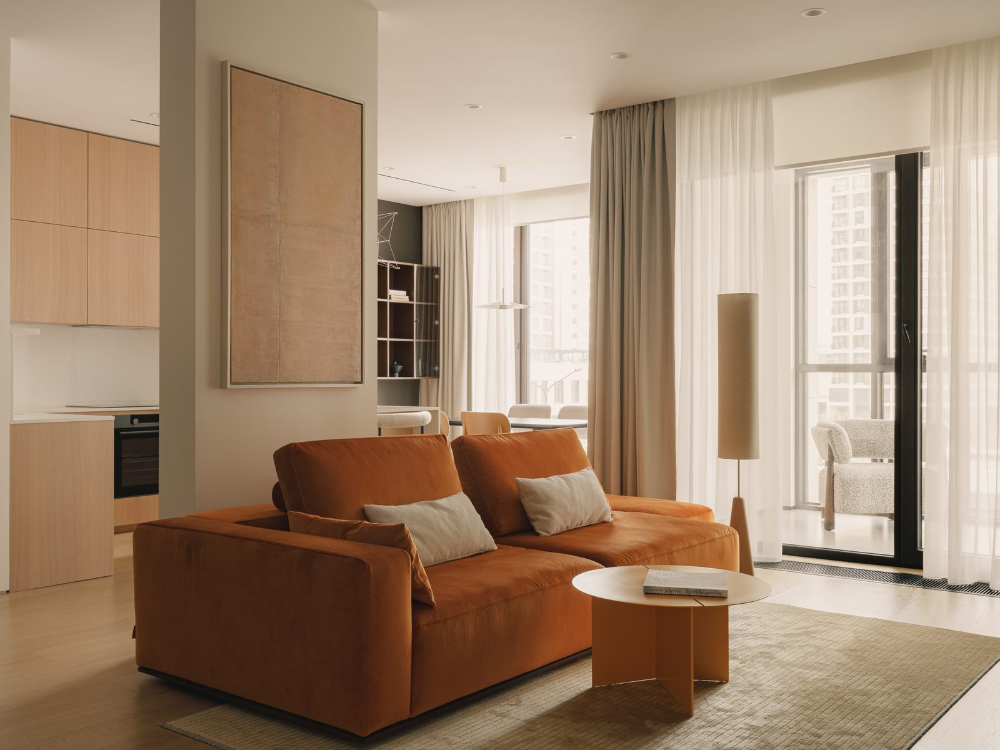

# ann tim — сайт

Свёрстано по макету `1_страница_1.jpg`. Размеры шапки, логотипа, меню и точек
карусели сняты с макета пиксель в пиксель и переведены во `vw`, поэтому
пропорции держатся на любой ширине экрана.

## Как посмотреть

Распакуйте архив и откройте `index.html` двойным кликом — всё заработает
как есть, включая шрифт и карусель. Сервер не нужен.

## Что внутри

```
index.html            главная: логотип, меню, карусель на весь экран
projects.html         Проекты      ┐
about.html            О нас        │ страницы-заглушки,
publications.html     Публикации   │ вёрстка шапки общая
contacts.html         Контакты     ┘
assets/
  css/styles.css      все стили, шрифт Manrope зашит внутрь (base64)
  js/main.js          карусель и меню на мобильных
  img/
    logo.png          логотип, вырезан из макета
    favicon.png
    slide-N-1000.webp   ┐ три размера под разные экраны
    slide-N-1600.webp   │ + jpg на случай старых браузеров
    slide-N-2400.webp   ┘
    mobile/
      mobile-slide-N-1000.jpg  ┐ вертикальные кадры для экранов
      mobile-slide-N-1400.jpg  ┘ шириной до 860 px
```

## Фотографии

Исходники весили 9–67 МБ и были в форматах, которые браузер не открывает
(один — TIFF). Пережаты под веб: 175–260 КБ на кадр в максимальном размере.

| Кадр    | Исходник                            | Кадрирование |
|---------|-------------------------------------|--------------|
| slide-1 | IMG_6665_tone_LizaGurovskaya.jpg    | 77 %         |
| slide-2 | Photo-34.tif                        | 68 %         |
| slide-3 | IMG_4504_LizaGurovskaya_копия.jpg   | 55 %         |
| slide-4 | Photo-56.jpg                        | 65 %         |

Кадрирование — это точка, по которой фото обрезается, когда пропорции экрана
не совпадают с пропорциями снимка. Задаётся в `index.html` у каждого кадра:

```html

```

Меньше процент — видно больше верха кадра, больше — больше низа.
Для slide-1 значение 77 % подобрано так, чтобы кадр совпал с макетом.

### Заменить или добавить фото

Положите новый файл в `assets/img/` в трёх размерах (1000, 1600, 2400 px по
ширине, WebP + JPEG) и скопируйте блок `<figure class="slide">` в `index.html`.
Точку в карусели добавьте вручную — в блоке `hero__dots` нужна одна кнопка
на кадр.

## Логотип

Вырезан из макета растром (238 × 194 px). Для печати и крупных экранов лучше
взять у дизайнера оригинал в SVG или PNG с прозрачным фоном и заменить
`assets/img/logo.png`.

## Карусель

Работает как слайд-шоу: кадры сменяются сами раз в 6 секунд, по кругу.

На экранах до 860 px карусель автоматически использует 7 вертикальных
фотографий из `assets/img/mobile/`. На более широких экранах остаются исходные 4
горизонтальных кадра. При повороте экрана нужная версия подхватывается без перезагрузки
страницы.

Пауза — только пока курсор наведён на сами точки, пока идёт листание
с клавиатуры и пока вкладка неактивна. На всю карусель пауза по наведению
не вешается специально: она занимает почти весь экран, и слайд-шоу
останавливалось бы практически всегда.

Точки, стрелки на клавиатуре и свайп на телефоне тоже работают — после
ручного переключения отсчёт до следующего кадра начинается заново.

Что можно покрутить:

| Что                   | Где                                    |
|-----------------------|----------------------------------------|
| Пауза между кадрами   | `DELAY` в `assets/js/main.js` (6000 мс)|
| Длительность перехода | `1.1s` у `.slide` в `styles.css`       |

Если в системе включено «уменьшение движения», кадры так же сменяются,
но переключаются мгновенно, без плавного растворения.

## Публикация

Сайт статический — файлы можно просто загрузить на любой хостинг:
Netlify, Vercel, GitHub Pages, Cloudflare Pages, обычный shared-хостинг.
Сборка не нужна.

## Мелочи, которые стоит доделать перед запуском

- заменить `<title>` и `description` на финальные тексты;
- добавить og-картинку для превью в мессенджерах;
- поставить счётчик аналитики;
- заменить логотип на векторный;
- заполнить четыре внутренних раздела.

## Если понадобятся отдельные файлы шрифта

Сейчас Manrope (200 и 300) зашит в `styles.css` через base64. Чтобы вынести
его отдельными файлами, возьмите `@fontsource/manrope` и замените в
`@font-face` длинную строку `url(data:font/woff2;base64,...)` на
`url("../fonts/manrope-cyrillic-300-normal.woff2")`.
